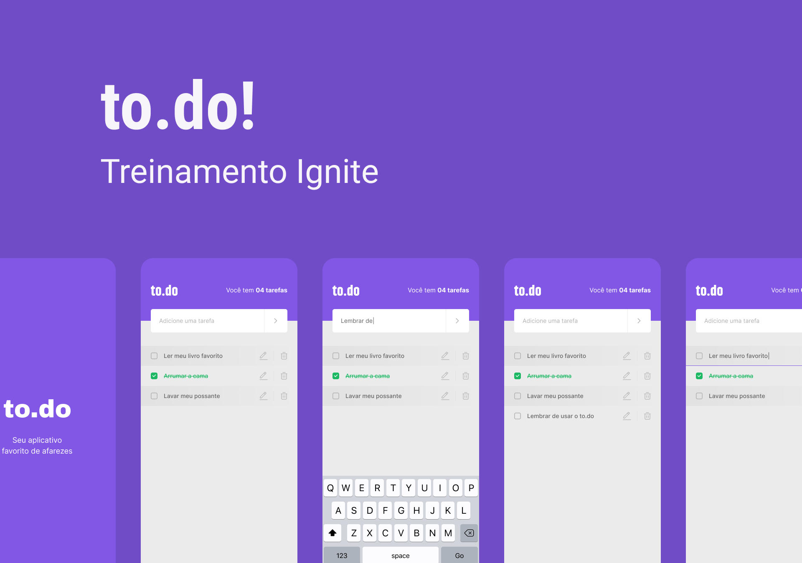

<h1 align="center">
    
</h1>

 <a href="#-demonstration">Demonstration</a>&nbsp;&nbsp;&nbsp;|&nbsp;&nbsp;&nbsp;
 <a href="#-technologies">Technologies</a>&nbsp;&nbsp;&nbsp;|&nbsp;&nbsp;&nbsp;
 <a href="#-layout">Layout</a>&nbsp;&nbsp;&nbsp;|&nbsp;&nbsp;&nbsp;
 <a href="#-clipboard-pré-requisitos">Clipboard</a>&nbsp;&nbsp;&nbsp;|&nbsp;&nbsp;&nbsp;
 <a href="#-settings">Settings</a>

---

O `to.do` é uma aplicação de lembrete de tarefas, onde você pode criar uma tarefa, marca/desmarcar a tarefa como feita, editar e até mesmo deletar tarefas já existentes.

* Este foi um projeto desenvolvido como conclusão de um desafio do curso Ignite da [Rocketseat](https://www.rocketseat.com.br/).

* Caso goste do projeto marque a estrelinha⭐ e compartilhe para me ajudar 👍, e me siga para ver outros projetos meus.

## 📷 Demonstration

    

## 🚀 Technologies
Esse projeto foi desenvolvido com as seguintes tecnologias:

✔ [React Native](https://reactnative.dev/)
 
✔ [TypeScript](https://www.typescriptlang.org/)
 
✔ [React Native Vector Icons](https://github.com/oblador/react-native-vector-icons)
 
✔ [React Native Linear Gradient](https://github.com/react-native-linear-gradient/react-native-linear-gradient)
 

## 🔖 Layout

Você pode visualizar o layout do projeto através [desse link](https://www.figma.com/file/L442P4syOkbHGaLr4fGad4/to.do/duplicate). É necessário ter conta no [Figma](https://www.figma.com/) para acessá-lo

## 📋 Clipboard (Pré-requisitos)

Antes de baixar o projeto você vai precisar ter instalado na sua máquina as seguintes ferramentas:

* [Git](https://git-scm.com)
* [NodeJS](https://nodejs.org/en/)
* [Yarn](https://yarnpkg.com/) ou [NPM](https://www.npmjs.com/)
* Ambiente pré-configurado para desenvolvimento com React Native, vejo como [neste link](https://reactnative.dev/docs/environment-setup)

## ⚙ Settings

Segue os comandos para baixar e executar o projeto na sua máquina:

* `git clone` + `URL do Repositório/Projeto`: clonar este repositório.
* `cd` + `pasta do Projeto`: entrar na pasta do projeto.
* `yarn`: para baixar as dependências do projeto.
* `yarn start`: executa o projeto (vai de sua escolha se vai usar um emulador ou aparelho físico para rodar a aplicação, veja mais sobre estes dois modos de execução [neste link](https://reactnative.dev/docs/environment-setup)).

## 📝 License

Esse projeto está sob a licença MIT. Veja o arquivo [LICENSE](LICENSE) para mais detalhes.

## ✍ Author

    Made with 💜 by PabloXT14

    
    

